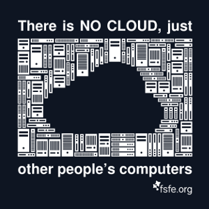

# Backup files to your Nextcloud with Rclone and BorgBackup

Webspace like e.g. provided via Nextcloud can be used to backup files. A good backup stragegy should integrate as good as possible into your daily work, such that the backups can be done hassle-free. This description will show you how to use [BorgBackup](https://borgbackup.readthedocs.io/en/stable/index.html) to first create snapshots of your local data and later send them via [Rclone](https://rclone.org/) to your webspace. 

## BorgBackup
BorgBackup, or short simply "borg", is a python commandline tool, which lets you create archives of files with the following features:
 * **compression**: Files can be compressed
   with different methods if wanted
 * **deduplication**: If you happen to save
   one file multiple times into your archive,
   this data will be deduplicated and only be
   stored once from borg
 * **incremental backups**: If you from one backup
   to the next just change a tiny bit of your
   data, basically only this tiny bit gets
   saved. This opens the possiblity to do
   backups much quicker once you saved
   them for the first time. 
 * **encryption**: borg is able to encrypt the
   files stored in its backup archiv thus making
   it save to store them at an unsafe
   place - like "the Cloud".
   Because remember:
   
   

## Rclone

To synchronise the archive made by borg to Nextcloud we use Rclone. Rclone is able to commuticate with a lot of storage providing software out there. So you might have a look at the [supported providers](https://rclone.org/#providers) if you are interested in using this documentation with something other than Nextcloud.

# Setting up BorgBackup to do its job
First you have to [install](https://borgbackup.readthedocs.io/en/latest/installation.html) borg. As it is available on the repositories of many platforms, it might just be as easy as
```
sudo apt install borgbackup
```
or
```
sudo pacman -S borg
```

# Rclone installation and configuration
First, [install](https://rclone.org/install/) Rclone as well.
```
sudo apt install rclone
```

## configuration of webspace
Rclone provides a step-by-step configuration which guides you to all the neccessary things you need to setup to use Rclone with your nextcloud. Simply start by typing `rclone config`

```
% rclone config
No remotes found - make a new one
n) New remote
s) Set configuration password
q) Quit config
n/s/q> n
name> nextcloud-name
```

Choose `webdav` as this is the network protocol used by nextcloud, see [here](https://rclone.org/webdav/), provide an URL to the webdav endpoint (usually by adding `remote.php/webdav` to your base URL) and lateron specify the type of webdav connection - `nextcloud` in this case.

```
Type of storage to configure.
Enter a string value. Press Enter for the default ("").
Choose a number from below, or type in your own value
Storage> webdav
** See help for webdav backend at: https://rclone.org/webdav/ **

URL of http host to connect to
Enter a string value. Press Enter for the default ("").
Choose a number from below, or type in your own value
 1 / Connect to example.com
   \ "https://example.com"
url>my.nextcloud-instance.com/remote.php/webdav
Choose a number from below, or type in your own value
 1 / Nextcloud
   \ "nextcloud"
 2 / Owncloud
   \ "owncloud"
 3 / Sharepoint
   \ "sharepoint"
 4 / Other site/service or software
   \ "other"
vendor>nextcloud
```
Now provide your individual login information. 
> **TIP:** It is very handy to generate a login token via the webfrontend of Nextcloud. This way, you can revoke this specific login at a later time without completely resetting your password. The token can be generated in `Settings → Security → Device & session → Create new app password`. This token will look like `t7j8o-qpW3H-Wy2BW-XC82X-t5pkM` and will only be showed once to you - so you better copy this token somewhere when you create it inside your Nextcloud))

```
User name
Enter a string value. Press Enter for the default ("").
user>username
y) Yes type in my own password
g) Generate random password
n) No leave this optional password blank (default)
y/g/n>y
Enter the password:
password:ENTER-TOKEN-HERE
Confirm the password:
password:ENTER-TOKEN-HERE
```

There is no bearer token needed, so you can now simply complete the setup by answering the defaults and finally quitting the rclone configuration with `q`:

```
Bearer token instead of user/pass (e.g. a Macaroon)
Enter a string value. Press Enter for the default ("").
bearer_token>
Edit advanced config? (y/n)
y) Yes
n) No (default)
y/n> n
Remote config
--------------------
[nextcloud-name]
type = webdav
url = my.nextcloud-instance.com/remote.php/webdav
vendor = nextcloud
user = username
pass = *** ENCRYPTED ***
--------------------
y) Yes this is OK (default)
e) Edit this remote
d) Delete this remote
y/e/d> y
Current remotes:

Name                 Type
====                 ====
nextcloud-name       webdav

e) Edit existing remote
n) New remote
d) Delete remote
r) Rename remote
c) Copy remote
s) Set configuration password
q) Quit config
e/n/d/r/c/s/q> q
```

That's it. Now you can test your connection by typing:
```
rclone lsd nextcloud-name:/
          -1 2020-11-29 23:59:49        -1 Documents
          -1 2020-11-29 23:59:49        -1 Photos
          -1 2020-11-29 23:59:49        -1 Talk

```
and a list of directories already existant on your nextcloud should pop up. If this is the case, everything works as it should.

> **TIP:** Use a password to keep your rclone configuration save. Do this by typing `s` to `rclone config`. This way you have to enter the password before using rclone. This might seem tedious but in this scenario nobody with bare access to your local user can simply alter the contents of your cloud. In a later step of the automatization we can store the password in a environment variable `RCLONE_CONFIG_PASS` to provide it behind-the-scenes to rclone.

In the same manner you could add more and different webspace options to your rclone config.
